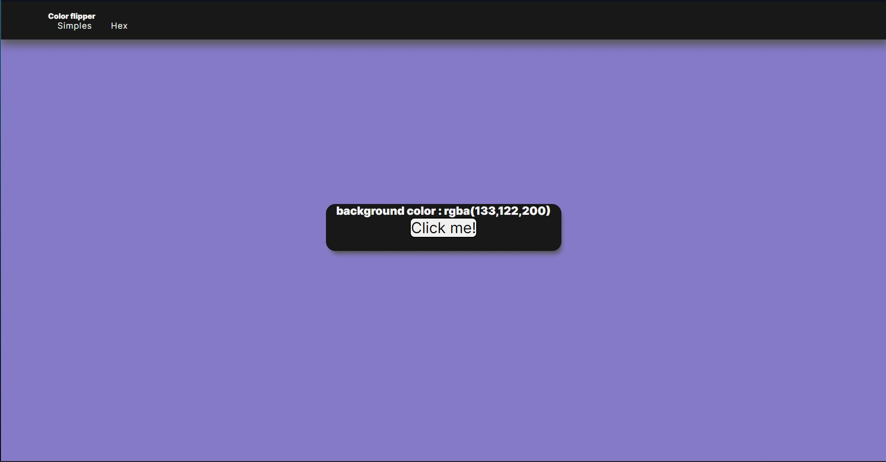

# Color flipper

>Gerador de cor

Color flipper é um gerador de cores aleatórias em cores simples, no modo simples. Ou mais aletatória e complexa no modo hex.

[Click aqui para acessar!](https://color-flipper-sable-one.vercel.app/)

## Tecnologias 🛠️
- HTML
- CSS
- JavaScript
- Git e GitHub

## Contato 📞

E-mail fabricio.ss2117@gmail.com

[WhatsApp](https://api.whatsapp.com/send?phone=5581983587510&text=Oi%2C%20Fabr%C3%ADcio.%20Eu%20vi%20seu%20portif%C3%B3lio%20e%20gostei%20muito%20do%20seu%20trabalho%2C%20gostaria%20de%20conversar%20contigo.)
[Linkedin](https://www.linkedin.com/in/fabricio-ss/)
[Instagram](https://www.instagram.com/fabricio_ss.dev/)
